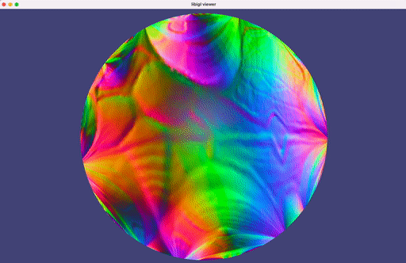

# libigl 🤝 TinyAD

A small example project mixing [libigl](https://github.com/libigl/libigl/) and
[TinyAD](https://github.com/patr-schm/TinyAD).  Launches the libigl viewer while
in a separate thread optimizing an armadillo mesh's parametrization.

## Compile

Compile this project using the standard cmake routine:

    mkdir build
    cd build
    cmake ..
    make

This should find and build the dependencies and create a `example` binary.

## Run

From within the `build` directory just issue:

    ./example

A glfw app should launch displaying an animating Armadillo parametrization.



_Derived from
[parametrization_libigl.cc](https://github.com/patr-schm/TinyAD-Examples/blob/main/apps/parametrization_libigl.cc)_

## Ordering

TinyAD operates most conveniently on nodal vector values (e.g., vertex positions in `V`). If `V` contains nodal vectors **per row**, then regardless of whether `V` is stored as column-major (e.g., `Eigen::MatrixXd`) or row-major (e.g., `Eigen::Matrix<double,Eigen::Dynamic,Eigen::Dynamic,Eigen::RowMajor>`) the internal order of tiny-ad will correspond to [non-standard](https://en.wikipedia.org/wiki/Vectorization_(mathematics)) **row-major vectorization**.

That is, if
```
V = [
  x₀ y₀ z₀
  x₁ y₁ z₁
  …
  xₙ yₙ zₙ
  ]
```

Then TinyAD will vectorize this into
```
x = [
  x₀
  y₀
  z₀
  x₁
  y₁
  z₁
  …
  xₙ
  yₙ
  zₙ
  ]
```

And use a corresponding ordering for gradients and Hessians.

This is ignorable if you're using the provided `func.x_from_data` and `func.x_to_data`. However, if you're mixing in your own gradients, Hessians, constraint projections, subspace bases, then take care!
